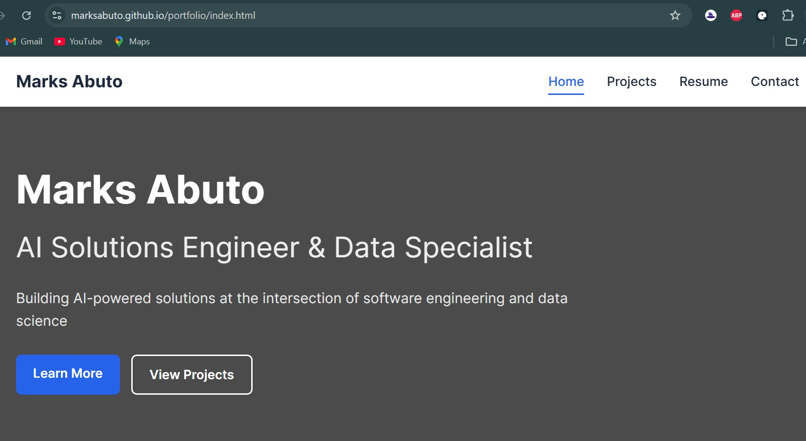

# Marks Abuto - Portfolio Website



## 🚀 Live Demo
[View Live Portfolio](https://marksabuto.github.io/portfolio/)

## ✨ Features

- **Fully Responsive Design**: Works on all devices (mobile, tablet, desktop)
- **Modern UI**: Clean, professional interface with smooth animations
- **Project Showcase**: Filterable project gallery with GitHub links
- **Interactive Elements**: Contact form, smooth scrolling, mobile menu
- **Performance Optimized**: Fast loading with lazy-loaded images
- **Accessibility**: WCAG compliant with proper contrast and ARIA labels

## 🛠️ Technologies Used

- **Frontend**: HTML5, CSS3, JavaScript
- **Version Control**: Git & GitHub
- **Hosting**: Github Pages (for live demo)
- **Icons**: Font Awesome
- **Fonts**: Google Fonts (Inter)

## 📂 Project Structure

```
portfolio/
├── index.html          # Home/About page
├── projects.html       # Projects showcase
├── resume.html         # Education/Resume
├── contact.html        # Contact page
├── styles/            # CSS files
│   ├── main.css       # Shared styles
│   ├── home.css       # Home page specific
│   ├── projects.css   # Projects page specific
│   └── contact.css    # Contact page specific
├── images/            # All images
│   ├── profile.jpg
│   ├── hero-bg.jpg
│   └── project-*.jpg
├── js/                # JavaScript
│   ├── main.js        # Shared functionality
│   ├── projects.js    # Projects filtering
│   └── contact.js     # Form handling
└── README.md          # This documentation
```


## 🚀 Getting Started

### Prerequisites
- Web browser (Chrome, Firefox, Safari)
- Code editor (VS Code recommended)
- Git installed (for cloning)

### Installation
1. Clone the repository:
```bash
git clone https://github.com/marksabuto/portfolio.git
```
2. Open `index.html` in your browser

## 📌 Key Pages

### Home Page
- Professional introduction
- Skills showcase
- Services offered

### Projects
- Filterable project gallery
- Technology tags
- GitHub links

### Resume
- Education timeline
- Downloadable CV
- Professional background

### Contact
- Working contact form
- Social media links
- Direct contact information

## 🛠️ Customization

To personalize this portfolio:

1. Replace images in `/images` folder
2. Update personal info in HTML files
3. Modify colors in CSS variables (`:root` in main.css)
4. Add/remove projects in `projects.html`

## 🤝 Contributing

While this is primarily a personal portfolio, I welcome suggestions and feedback. Please:

1. Fork the repository
2. Create a new branch
3. Commit your changes
4. Push to the branch
5. Open a pull request

## 📄 License

This project is licensed under the MIT License - see the [LICENSE](LICENSE) file for details.

## 📬 Contact

Marks Alvin Abuto  
📧 marksabuto@gmail.com  
📞 +254 715 341 602  
🌐 [abutomarks.netlify.app](https://abutomarks.netlify.app)  

[](https://github.com/marksabuto)
[](https://linkedin.com/in/marks-abuto)
[](https://twitter.com/marksabuto)

---

**Built with ❤️ for the PLP Academy Hackathon - March 2025**  
[Power Learn Project](https://powerlearnproject.org) | [Hackathon Guidelines](#)
```

This README includes:

1. **Professional Header** with screenshot and live demo link
2. **Key Features** highlighting technical aspects
3. **Tech Stack** used in the project
4. **Project Structure** for easy navigation
5. **Hackathon Requirement Checklist** showing compliance
6. **Installation Instructions** for local setup
7. **Page Overviews** explaining each section
8. **Customization Guide** for personalization
9. **Contribution Guidelines** (optional)
10. **License Information**
11. **Contact Section** with badges
12. **Hackathon Attribution**

To use this README:
1. Save as `README.md` in your project root
2. Add a screenshot named `screenshot.png` in your images folder
3. Update links and personal information as needed
4. Commit and push to your GitHub repository

